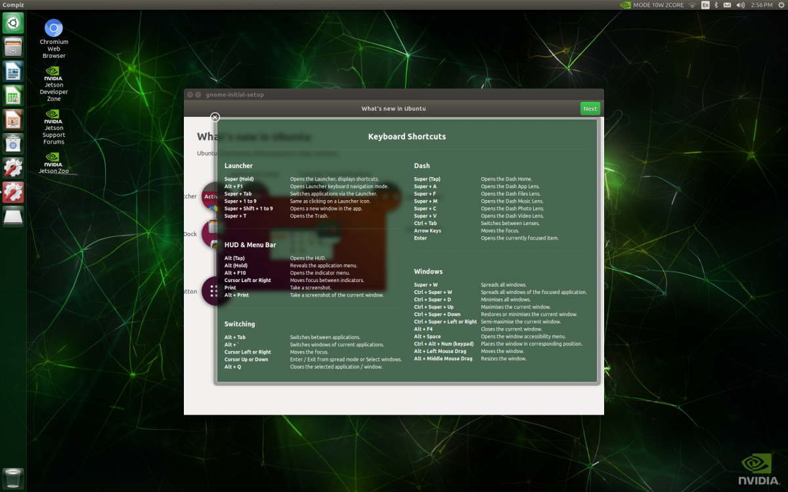
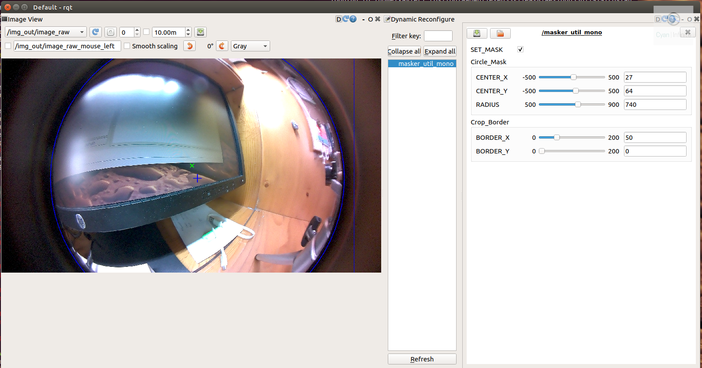

# nvjt_cam - DOCUMENTATION

```C++
/*
DOCUMENTATION.md
              _ __                 
  ___ _  __  (_) /_  _______ ___ _ 
 / _ \ |/ / / / __/ / __/ _ `/  ' \
/_//_/___/_/ /\__/__\__/\_,_/_/_/_/
        |___/   /___/              
        
Copyright (C) 2020 nvjt_cam
By 1487Quantum (https://github.com/1487quantum)
*/
```


## Prerequisites
### Before we begin...
Before we begin, we would assume that you would have the following background or attributes:
- Experience with ***Linux (Ubuntu)***, including experience with handling ***basic terminal commands*** such as `cd, ls, mv, mkdir, less, cp, ln, rm`, etc.
- Able to create & understand basic ***Bash*** scripts, which would be convenient in automating certain processes or debugging/understanding scripts that are copied online.
- Worked with ***C++*** and ***Python 2.7/3***, which is required to create the various ***OpenCV, ROS*** programs and for debugging purposes.
- Experience with ROS, such as understanding the basic workings of ROS, setting up workspaces, using or creating ROS packages.
- Willing to spend the extra effort & time to resolve issues: Sometimes certain code, packages or tools may not work as expected, be prepared to spend time looking through the web, asking in forums, trying things out and stuff to solve and expected issues. (You might even need to reinstall the entire operating system if the mistakes that are made prevents the system from booting up)

> **Disclaimer:** 
>
> - Please use this documentation as a guide and reference, do not blindly follow the steps mentioned without understanding what the command or program does.
> - Ensure that you backup your programs regularly, as you may accidentally break the system which prevent you from booting up.
>  **[You have been warned]**

### Hardware
The following hardware(s) are used in this documentation:

**Main**

* Nvidia Jetson Xavier NX Development Board (64Bit ARM Cortex Architecture)
* MicroSD Card (16GB UHS-1 minimum, 32GB recommended)
* Input Peripherals: Keyboard & Mouse
* Computer Display (Either DisplayPort (DP) or HDMI)

**Flashing tools**

* USB microSD card reader (or any related reader)

**Cameras**

* RPi Camera v2 (IMX219) x 2
* RPi Camera v2 (IMX219) with Entaniya Wide-angle fisheye Lens (220 FoV) Adapter x 2

> **Note:** 
> 1. The  Jetson Xavier NX does not come with a microSD card, you would have to get one yourself.
> 2. The Jetson Nano would most likely be fine too, however the performance would not be as good as the Xavier NX.

## Software 
### Host computer
A computer with internet connection is required to download and flash the image into the development board.

### Jetson Development Board
JetPack 4.4 is used for the development board as of the writing of this documentation (03/08/2020). Below are further details of the software (packages):
| Jetpack L4T R33 (Ubuntu 18.04 Bionic Beaver)| OpenCV 3.4.11 | ROS Melodic |
| :-: | :-: | :-: |
|  |  |  |

> Additional information on the Jetson Xavier NX could be found [here <sup>[2]</sup>](https://developer.download.nvidia.com/assets/embedded/secure/tools/files/jetpack-sdks/jetpack-4.4-ga/Jetson_Xavier_NX_Developer_Kit_User_Guide.pdf?8tWMbMo8_Y4hG9qZYei-ovmZeb3vauqcKptagrRXooeTRcz-j7JuGEkwQ2RflkxD64YSASjXfKIGOHFnRgFusdE-be31rblZqb2zIsy1UuwiloReJFipOB2qnuMNSrMIcxd5z3zanRgWGELNvfQHrKbft56MJwLiMlj_ylAjkBxcUDzRQjugWGdFBBCLUw0Q1gO0kKsJ2f6_MStlJCLW-sRX-o8B4IFycH5l).

## Jetson Setup
### Downloads
Download the image and the flashing program(s) <sup>[1]</sup>:
- [SDcard Image](https://developer.nvidia.com/jetson-nx-developer-kit-sd-card-image): You'll need to create and sign in into NVIDIA Developer Program to download the image. (It would be in a zip file, for example `nv-jetson-nano-sd-card-image-r32.4.2.zip`.) 
- [Etcher](https://www.balena.io/etcher/): Download and install _Etcher_ to flash the image into the Jetson Xavier NX.

### Preparation, Flashing & Setup

> Most of the instruction would be adapted from here <sup>[1]</sup>.

- Format the microSD card before using it, which could be done so via [SD Memory Card Formatter for Windows](https://www.sdcard.org/downloads/formatter/eula_windows/) <sup>[1]</sup>.
- After formatting the microSD card, leave the microSD card in the card reader (or attach the USB microSD card reader as needed).  If Windows prompts to format the card, just click _Cancel_.
- Launch _Etcher_.


- Click on _Select Image_ and select the zip image that is downloaded previously. the _Select Drive_ button would be enabled after selection.
- After that, click on _Select Drive_ and select the Drive that the SD card is in. (It is advised to detach all unnecessary data drives connected via USB just to play safe.)


- The _Flash_ button should be enabled now. Click on the _Flash_ button to begin the flashing process. After the Flashing has been completed, Windows would prompt to format the microSD card. Just click _Cancel_ and eject the microSD card or Card reader from the host computer. The microSD Card is ready to be loaded onto the Xavier NX.
- Insert the SD card image into the Xavier NX. It is located somewhere in the middle of the Xavier NX module.
| microSD card location | microSD card slot - Side View | Inserting the microSD card |
| :-: |  :-: |  :-: |
|   |  |  |

- After that, connect all the required peripherals onto the Xavier NX. (Power Supply, Keyboard + Mouse, Display) Power on the Jetson Xavier NX, a green LED near the microUSB port would light up.
- When the Board is first booted, the Jetson Xavier NX Developer Kit will take you through some initial setup, which includes:
	- Review & accept NVIDIA Jetson software EULA
	- System language, keyboard layout, and time zone selection
	- Wireless network Setup
	- Create username, password, and computer name
- Once all the setup is done, the board would boot into the system.


## Camera Setup

We'll be using the Raspberry Pi Camera v2 (IMX219) CSI cameras that would be attached to the  MIPI ports that are found on the left of the board. There are 2 ports available to be used, which depends on the camera application requirements.

### Specifications
#### RPi Camera v2


Below are the specifications <sup>[3]</sup> of the Raspberry Pi Camera v2, which uses the Sony IMX219 sensor.

| Model | Camera Module v2 |
| :--: | :--: |
| Approximate Size (mm) | 25 × 24 × 9 |
| Weight (g) | 3 |
| Still resolution | 8 Megapixels |
| Sensor | Sony IMX219 |
| Sensor resolution | 3280 × 2464 pixels |
| Sensor image area  | 3.68 x 2.76 mm (4.6 mm diagonal) |
| Pixel size | 1.12 µm x 1.12 µm |
| Optical size | 1/4" |
| Fixed focus | 1 m to infinity |
| Focal length | 3.04 mm |
| Horizontal field of view (H-FoV) | 62.2 degrees |
| Vertical field of view (V-FoV) | 48.8 degrees |
| Focal ratio (F-Stop) | 2.0 |

#### Entaniya Wide Angle Fisheye Lens Adapter
| | |
| :-: | :-: |
| |  |
The adapter uses the same RPi camera as mentioned above, the only difference would be the lens configuration <sup>[4]</sup>.

|   | Entaniya Wide Angle Fisheye Lens Adapter |
| :--: | :--: |
| Dimensions (mm) | 35 x 21.7 x 24 |
| Focal length | 0.79 mm |
| Horizontal field of view (H-FoV) | 62.2 degrees |
| Vertical field of view (V-FoV) | 48.8 degrees |
| Focal ratio (F-Stop) | 2.1 |


### Connection(s)

The ribbon could be easily attached into the MIPI ports by lifting up the latch and inserting into the port. After the ribbon is inserted, press the tab down to lock the ribbon in place. Ensure that the metal connection of the ribbon is facing "away" from the tab.

### Testing the camera(s)
_Gstreamer_ is used to access the image feed of the camera(s). To test the camera, we could run the following:
```bash
$ gst-launch-1.0 nvarguscamerasrc sensor_mode=0 ! 'video/x-raw(memory:NVMM),width=3820, height=2464, framerate=21/1, format=NV12' ! nvvidconv flip-method=0 ! 'video/x-raw,width=960, height=616' ! nvvidconv ! nvegltransform ! nveglglessink -e
```

This would launch a EGL window with the camera image feed at a resolution of _3820x2464_. There are 6 modes that could be used for the `sensor_mode` of IIMX219 RPi v2 camera, the table below summarises the available modes:

| Sensor Mode | Resolution | Framerate (Max) |
| :--------: | :--------: | :--------: |
| 0 | 3264 x 2464 | 21 |
| 1 | 3264 x 1848 | 28 |
| 2 | 1920 x 1080 | 30 |
| 3 | 1280 x 720 | 30 |
| 4 | 1280 x 720 | 60 |
| 5 | 1280 x 720 | 120 |

> To get all the available `sensor_mode`, you could run `$ v4ls-ctl -list-formats-ext`

## Software Setup
### OpenCV
The Jetpack (aka Ubuntu) comes with OpenCV 4.1.1 by default, however it does not have CUDA support by default. One of the only solution is to compile OpenCV from source, enabling the CUDA support in the Makefile configuration.

A bash script could be used to simplify the compilation of OpenCV via `installOpenCV.sh`, which is found in the _scripts_ directory. Update the script(s) permissions before running.

> **Note:** The documentation would be using OpenCV 3.4.11 as the installation default, however you could change the versions accordingly.

```bash
$ sudo chmod +x 
$ sudo ./installOpenCV.sh	#Run script with sudo
```

### ROS
We would be using ROS Melodic in the documentation, and would be using the _Desktop version_ of ROS. (The installation would be adapted from the ROS wiki <sup>[5]</sup>.)

#### Setup
Open up a terminal via `Ctrl+Alt+T`, we would be first setting up the Xavier NX to accept the software from _packages.ros.org_.
```bash
$ sudo sh -c 'echo "deb http://packages.ros.org/ros/ubuntu $(lsb_release -sc) main" > /etc/apt/sources.list.d/ros-latest.list'
```
After that, we would be adding the _apt key_, after which we would update the repository list:
```bash
$ sudo apt-key adv --keyserver 'hkp://keyserver.ubuntu.com:80' --recv-key C1CF6E31E6BADE8868B172B4F42ED6FBAB17C654
$ sudo apt update
```
Install the __ROS Desktop__ install, which includes ROS with _rqt, rviz_, and robot-generic libraries.
```bash
$ sudo apt install ros-melodic-desktop
```
> We would not be installing the _Desktop-Full Install_ as the space in the Xavier NX is limited and it may not be able to handle all the packages.

Initialize _rosdep_. _rosdep_ enables you to easily install system dependencies for source code you want to compile and is required to run some core components in ROS:
```bash
$ sudo rosdep init 
$ rosdep update
```

> If _rosdep_ is not installed, it could be done so via `$ sudo apt install python-rosdep`.

It is recommended to add the ROS environment variables automatically to your bash session every time a new shell is launched, which could be done so by the following line:
```bash
$ echo "source /opt/ros/melodic/setup.bash" >> ~/.bashrc
$ source ~/.bashrc
```

**Creating the `catkin` workspace**
To start running your own ROS packages or install other packages from source, a catkin workspace has to be created. We would be using the classical `catkin_ws` as our workspace directory.

Create the `catkin_ws` directory:
```bash
$ mkdir -p ~/catkin_ws/src # The -p option is to create the directory only if it does not exists
$ cd ~/catkin_ws/
```
After that, we could run `catkin_make` to initialise the workspace. Running it the first time in your workspace, it will create a CMakeLists.txt link in your 'src' folder. 
```bash
$ catkin_make
```
Finally, append the workspace directory script to  your _.bashrc_ script (in your `~/` or `home` directory):
```bash
$ echo "source ~/catkin_ws/devel/setup.bash" >> ~/.bashrc 
$ source ~/.bashrc
```
Your catkin workspace is now ready to compile your ROS packages located in the `src` directory.

## Essential Tools/Packages

> Tools & ROS packages that are used to monitor the system, access the CSI camera(s), etc.

### Jetson Stats (jtop)
A utility to monitor the performance and system status of the Xavier NX, such as the CPU/GPU cores, memory usage, heatsink fan control, etc. (Similar to htop)


Install the utility via pip install:
```bash
$ sudo -H pip install -U jetson-stats
```

To run the utility, simply run `jtop`.
```bash
$ jtop
```
(To control the fan speed and other MISC stuff, run it as _superuser_ via `$ sudo jtop`)

> More information could be found [here <sup>[6]</sup>](https://github.com/rbonghi/jetson_stats).

### jetson_csi_cam (ROS Packge)

> A ROS package making it simple to use CSI cameras on the Nvidia Jetson TK1, TX1, TX2 or Nano with ROS.

#### Dependencies

For the purpose of this guide <sup>[7]</sup>, we will assume you already have:

- Gstreamer-1.0 & Nvidia multimedia API (typically installed by Jetpack)
- ROS Melodic (Older versions of ROS may work, provided that a version of gscam that supports gstreamer-1.0 is available for that ROS version, but this is untested.)
- `gscam` with gstreamer-1.0 support. (The following steps will show how to build gscam from source to support this)

With these dependencies accounted for, lets get everything installed.

#### Download jetson_csi_cam

Clone this repository into you catkin_workspace.
```bash
$ cd ~/catkin_workspace/src
$ git clone https://github.com/1487quantum/jetson_csi_cam.git 
```
#### Install gscam (with gstreamer-1.0 support)

Clone gscam into your catkin_workspace.
```bash
$ cd ~/catkin_workspace/src
$ git clone https://github.com/ros-drivers/gscam.git
```
Then edit `./gscam/Makefile` and add the _CMake flag_` -DGSTREAMER_VERSION_1_x=On` to the first line of the file, so that it reads:
```
EXTRA_CMAKE_FLAGS = -DUSE_ROSBUILD:BOOL=1 -DGSTREAMER_VERSION_1_x=On
```
While this flag is only necessary if you have both gstreamer-0.1 and gstreamer-1.0 installed simultaneously, it is good practice to include.

> If there are missing dependencies, `rosdep` coulde be used to install the missing packages:` $ rosdep install --from-paths src --ignore-src --rosdistro=${ROS_DISTRO} -y`

#### Build everything

Now we build and register gscam and jetson_csi_cam in ROS.
```bash
$ cd ~/catkin_workspace
$ catkin_make
$ source ~/.bashrc
```
At this point everything should be ready to go.

#### Usage
To publish your camera's video to ROS (using the default settings) execute the following:
```bash
$ roslaunch jetson_csi_cam jetson_csi_cam.launch
```
> Wait, where is the video? This launch file only publishes the video to ROS, making it available for other programs to use. This is because we don't want to view the video every time we use the camera (eg the computer may be processing it first). 
> Thus we use separate programs to view it. I'll discuss this in a later section, but if you can't wait, run rqt_image_view in a new terminal to see the video.

You can confirm the video is running by entering ` $ rostopic list` in the terminal. You should be able to see the _/csi_cam/image_raw topic_ (aka your video) along with a bunch of other topics with similar names (unless you changed the `camera_name` argument from the default).

More information on the video options could be found [here](https://github.com/1487quantum/jetson_csi_cam#setting-video-options).

### image_pipeline (ROS Package)

> An image processing pipeline for ROS.

You could either compile the repository from source or install it through the repo via `apt`.

__Via `apt`__

Install the image_pipeline repository with the following command:

```bash
$ sudo apt install ros-melodic-image-pipeline
```

__Compile from source__

First, enter the workspace and _git clone_ the repository (melodic branch) into `catkin_ws/src`:

```bash
$ cd ~/catkin_ws/src
$ git clone https://github.com/ros-perception/image_pipeline -b melodic
```

>  If there are missing dependencies, `rosdep` coulde be used to install the missing packages:` $ rosdep install --from-paths src --ignore-src --rosdistro=${ROS_DISTRO} -y`

After that, compile the package via `catkin_make`.

```bash
$ cd ~/catkin_ws
$ catkin_make
```

### vision_opencv (ROS Package)

Required to perform OpenCV operations with ROS, it could be installed via `apt`:

```bash
$ sudo apt install ros-melodic-vision-opencv
```
Alternatively, it could be compiled from source:
```bash
$ cd ~/catkin_ws/src
$ git clone https://github.com/ros-perception/vision_opencv -b melodic
$ cd ~/catkin_ws
$ catkin_make
```

>  If there are missing dependencies, `rosdep` coulde be used to install the missing packages:` $ rosdep install --from-paths src --ignore-src --rosdistro=${ROS_DISTRO} -y`

### masker_util (ROS Package)


A ROS package for Image masking & cropping utility for fisheye / wide-angle / omnidirectional image.

> This utility tool is useful for the Wide-angle fisheye lens adapter camera(s).

#### Installation

Git clone the repository into your workspace (e.g. catkin_ws).

```bash
$ cd catkin_ws/src
$ git clone https://github.com/1487quantum/masker_util.git
```

After that, recompile the workspace.

```bash
$ catkin_make
```

#### Launch files

Launch the masker_util node via *masker_util_mono.launch*.

```bash
$ roslaunch masker_util masker_util_mono.launch
```

To mask the image feed, the *masker_util_stereo.launch* could be used.

```
$ roslaunch masker_util masker_util_stereo.launch
```

#### Modes

There are 2 modes for the masker utils:

- **Normal Mode**: Apply the mask on the output image.
- **Debug Mode (Default)**: Used to position and set the mask in place, with the markings overlay to guide the placement of the mask.

**Legend**
- *Green cross marker*: Represents the center of the image.
- *Blue plus marker*: Represents the center of the circle mask.
- *Blue circle*: Represents the mask. Area outside the circle would be filtered out as black.
- *Rectangular border*: Represents the new image size, which would be cropped to *center* the image output.

> More information could be found [here.](https://github.com/1487quantum/masker_util)

## Camera Calibration
### Normal Lens 
For calibrating either one or both of the RPi v2 Camera(s), it could be done so via the _camera_calibration_ ROS package. More information is available [here](http://wiki.ros.org/camera_calibration/Tutorials).

### Wide angle fisheye lens
We will be using the `omni_proc_ros` package to perform camera calibration and image rectification for the wide-angle fisheye lens, which utilises the _Omnidirectional camera model_ of OpenCV.

More information on how to setup the package is available [here.](https://github.com/1487quantum/omni_proc_ros.git)

## Applications

### vilib_ros wrapper


ROS wrapper for CUDA Visual Library by RPG.

> Tested with ROS melodic with custom OpenCV installation. (3.4.10)
> 
> More information on the ROS package could be found [here.](https://github.com/1487quantum/vilib_ros)

#### Dependencies

The following packages are required for the vilib_ros wrapper.

__CUDA__

Ensure that the CUDA toolkit has been installed: https://developer.nvidia.com/cuda-toolkit
(Should be preinstalled with the Jetson Xavier NX)

__vilib__

The library could be found [here](https://github.com/uzh-rpg/vilib), follow the installation steps to install the library.


#### Nodes

There are 2 nodes for this package, which are:

- vilib_ros_node: FAST corner detection via the vilib FAST library
- vilib_ros_tracker: Lucas - Kanade Feature Tracking via the vilib FAST library

#### Dynamic Reconfigure

This wrapper supports dynamic reconfiguration of the various parameters for the nodes! Launch `rqt_reconfigure` and adjust the parameters accordingly.

```bash
$ rosrun rqt_reconfigure rqt_reconfigure
```

#### Troubleshooting

- If there is compilation issue of cv_bridge caused by the being unable to locate the OpenCV path, the cv_bridge cmake have to be updated to  point to the new path. For example, updating the path

```makefile
if(NOT "include;/usr/include;/usr/include/opencv" STREQUAL " ")

  set(cv_bridge_INCLUDE_DIRS "")
  set(_include_dirs "include;/usr/include;/usr/include/opencv")
```

to

```makefile
if(NOT "include;/usr/local;/usr/local/opencv/include" STREQUAL " ")

  set(cv_bridge_INCLUDE_DIRS "")
  set(_include_dirs "include;/usr/local/opencv/include;/usr/local/opencv/include/opencv2")
```

### gpu_stereo_image_proc

Stereo and image rectification and disparity processing with NVIDIA VisionWorks and fixstars libSGM , and contains the launch files for both the stereo block matching (sbm) and the semi global block matching algorithm of CPU. Follow the setup instructions as specified [here.](https://github.com/1487quantum/gpu_stereo_image_proc)

> **Note:** Open a new terminal for each command mentioned below, as each would launch a process on it's own.

Launch the stereo camera and nodelet manager first:

```bash
# Launch the stereo camera
$ rosrun jetson_csi_cam jetson_stereo.launch
# Launch your nodelet manager
$ rosrun nodelet nodelet manager __name:=manager # Note that manager must be located in global namespace
```

After that, run the preferred algorithm to be used:

- Nvidia VisionWorks libVX (GPU): `roslaunch gpu_stereo_image_proc vx_stereo_image_proc.launch manager:=/manager __ns:=cam`

- fixstars libSGM (GPU): `roslaunch gpu_stereo_image_proc libsgm_stereo_image_proc.launch manager:=/manager __ns:=cam`

- `sbm` or `sgbm` algorithm (CPU): `roslaunch gpu_stereo_image_proc vx_stereo_image_proc.launch manager:=/manager __ns:=cam`

After that, launch another terminal view the disparity image via `disparity_view`.

```bash
$ rosrun image_view disparity_view image:=/cam/disparity
```

Open another terminal and launch `rqt_reconfigure`. This would allow one to tune the parameters of the algorithms:

```bash
$ rosrun rqt_reconfigure rqt_reconfigure
```

The algorithms would publish a few topics, the 2 most commonly used ones are 

- /cam/disparity: The disparity map between the 2 images.
- /cam/points2: The PointCloud (PCL) obtained via the disparity map.


### Neven PCL processing

Object segmentation via PCL Euclidean Cluster Extraction, publishes cluster centroid markers and cluster boundary cuboid markers via Rviz.

> More information on the ROS package could be found [here.](https://github.com/1487quantum/neven_ros)


## References

[1] https://developer.nvidia.com/embedded/learn/get-started-jetson-xavier-nx-devkit
[2] https://developer.download.nvidia.com/assets/embedded/secure/tools/files/jetpack-sdks/jetpack-4.4-ga/Jetson_Xavier_NX_Developer_Kit_User_Guide.pdf?8tWMbMo8_Y4hG9qZYei-ovmZeb3vauqcKptagrRXooeTRcz-j7JuGEkwQ2RflkxD64YSASjXfKIGOHFnRgFusdE-be31rblZqb2zIsy1UuwiloReJFipOB2qnuMNSrMIcxd5z3zanRgWGELNvfQHrKbft56MJwLiMlj_ylAjkBxcUDzRQjugWGdFBBCLUw0Q1gO0kKsJ2f6_MStlJCLW-sRX-o8B4IFycH5l
[3] https://www.raspberrypi.org/documentation/hardware/camera/
[4] https://docs.rs-online.com/7a98/0900766b81618985.pdf
[5] http://wiki.ros.org/melodic/Installation/Ubuntu
[6] https://github.com/rbonghi/jetson_stats
[7] https://github.com/peter-moran/jetson_csi_cam